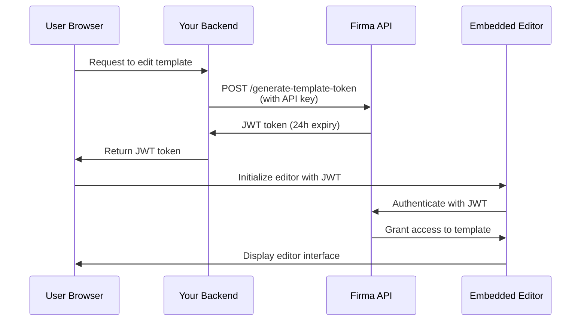

# API Authentication & JWT Tokens

The Firma Partner API uses two authentication methods: API key authentication for server-to-server requests, and JWT tokens for embedding the template and signing request editors in your application.

## API Key Authentication

All API endpoints require authentication using an API key in the `Authorization` header.

### How it Works

Your API key authenticates your requests and determines which workspace resources you can access. Each workspace has its own unique API key that you can retrieve via the [Get Workspace](/api-reference/v01.00.01/workspaces/get-workspace) endpoint.

**Protected Workspace**: Every company account has one protected workspace that cannot be deleted. This protected workspace holds the main API key for your account, which has access to all workspace, API key, company/account, and webhook endpoints. Use this key for account-wide operations or when you need to manage multiple workspaces.

### API Key Rotation

You can regenerate API keys for non-protected workspaces to enhance security. When you regenerate a key:

1. **A new API key is created immediately** and returned in the response
2. **Old keys are set to expire in 24 hours** - they continue working during this grace period
3. **You can manually expire old keys early** once you've verified the new key works

<Note>
**Protected workspace keys cannot be regenerated** via the API. This prevents accidental lockouts from your account. Contact support if you need to rotate your protected workspace key.
</Note>

#### Regenerate API Key

Generate a new API key for a workspace. The old key will automatically expire after 24 hours:

```javascript
const response = await fetch(
  `https://api.firma.dev/functions/v1/signing-request-api/workspaces/${workspaceId}/api-key/regenerate`,
  {
    method: 'POST',
    headers: {
      'Authorization': process.env.FIRMA_API_KEY,
      'Content-Type': 'application/json'
    }
  }
);

const result = await response.json();
console.log('New API key:', result.new_key);
// Store the new key securely
```

**Response:**
```json
{
  "message": "API key regenerated. Old keys will expire in 24 hours.",
  "workspace_id": "123e4567-e89b-12d3-a456-426614174000",
  "new_key": "firma_api_abc123xyz...",
  "expiring_keys": [
    {
      "id": "old-key-uuid",
      "expires_at": "2025-12-19T10:30:00Z"
    }
  ]
}
```

#### Expire Old Keys Early

After verifying your new key works, you can immediately expire all pending keys:

```javascript
const response = await fetch(
  `https://api.firma.dev/functions/v1/signing-request-api/workspaces/${workspaceId}/api-key/expire`,
  {
    method: 'POST',
    headers: {
      'Authorization': process.env.FIRMA_API_KEY,
      'Content-Type': 'application/json'
    }
  }
);

const result = await response.json();
console.log(`Expired ${result.expired_count} key(s)`);
```

**Response:**
```json
{
  "message": "Expired 1 pending API key(s)",
  "workspace_id": "123e4567-e89b-12d3-a456-426614174000",
  "expired_count": 1,
  "expired_keys": ["old-key-uuid"]
}
```

**Best Practice for Key Rotation:**
1. Call the regenerate endpoint to get a new key
2. Update your application configuration with the new key
3. Test that the new key works correctly
4. Call the expire endpoint to immediately invalidate old keys
5. Monitor for any errors indicating services still using the old key

<Warning>
**Never expose your API key in frontend code or client-side applications.** API keys should only be used in secure backend services. Always store them as environment variables.
</Warning>

### Header Format

The API key can be sent in two ways:

1. **Direct format** (recommended for simplicity):
```bash
Authorization: your-api-key-here
```

2. **Bearer token format** (optional):
```bash
Authorization: Bearer your-api-key-here
```

Both formats are accepted. The Bearer prefix is optional but not required.

### Code Examples

<CodeGroup>

```bash cURL
curl https://api.firma.dev/functions/v1/signing-request-api/templates \
  -H "Authorization: YOUR_API_KEY" \
  -H "Content-Type: application/json"
```

```javascript JavaScript
const response = await fetch(
  'https://api.firma.dev/functions/v1/signing-request-api/templates',
  {
    headers: {
      'Authorization': process.env.FIRMA_API_KEY,
      'Content-Type': 'application/json'
    }
  }
);

const templates = await response.json();
```

```python Python
import os
import requests

headers = {
    'Authorization': os.environ['FIRMA_API_KEY'],
    'Content-Type': 'application/json'
}

response = requests.get(
    'https://api.firma.dev/functions/v1/signing-request-api/templates',
    headers=headers
)

templates = response.json()
```

</CodeGroup>

### Error Response

If your API key is missing or invalid, you'll receive a `401 Unauthorized` response:

```json
{
  "error": "Unauthorized",
  "code": "UNAUTHORIZED",
  "message": "Invalid or missing API key"
}
```

---

## JWT Tokens for Embedded Features

JWT (JSON Web Token) tokens enable you to embed Firma's template editor and signing request editor directly in your application. These tokens are RSA-256 signed and time-limited for security.

### When to Use JWT Tokens

Use JWT tokens when you want to:

- Embed the template editor in your application for users to create/edit document templates
- Embed the signing request editor for users to customize documents before sending
- Provide secure, time-limited access to specific templates or signing requests
- Control which resources users can access without exposing your API key

<Note>
**JWT tokens should always be generated from your secure backend**, never from frontend code. Your backend uses the API key to generate tokens, which are then passed to the frontend for editor initialization.
</Note>

### JWT Token Types

| Token Type | Endpoint | Expiration | Use Case |
|------------|----------|------------|----------|
| **Template Token** | [Generate JWT Token for Embedding Templates](/api-reference/v01.00.01/jwt-management/generate-jwt-token-for-embedding-templates) | 24 hours | Embed template editor for creating/editing templates |
| **Signing Request Token** | [Generate JWT Token for Signing Request](/api-reference/v01.00.01/jwt-management/generate-jwt-token-for-signing-request) | 24 hours | Embed signing request editor for document customization |

### Authentication Flow

Here's how JWT authentication works for embedded features:



### Implementation Guide

#### Step 1: Generate JWT Token (Backend)

Generate a JWT token from your secure backend using your API key:

<CodeGroup>

```javascript Node.js/Express
// Backend endpoint to generate JWT for template editing
app.post('/api/get-template-token', async (req, res) => {
  const { templateId } = req.body;

  try {
    const response = await fetch(
      'https://api.firma.dev/functions/v1/signing-request-api/generate-template-token',
      {
        method: 'POST',
        headers: {
          'Authorization': process.env.FIRMA_API_KEY,
          'Content-Type': 'application/json'
        },
        body: JSON.stringify({
          companies_workspaces_templates_id: templateId
        })
      }
    );

    const data = await response.json();
    
    // Return JWT to frontend (never expose API key)
    res.json({ 
      token: data.jwt,
      expiresAt: data.expires_at 
    });
  } catch (error) {
    res.status(500).json({ error: 'Failed to generate token' });
  }
});
```

```python Python/Flask
from flask import Flask, request, jsonify
import os
import requests

app = Flask(__name__)

@app.route('/api/get-template-token', methods=['POST'])
def get_template_token():
    template_id = request.json.get('templateId')
    
    try:
        response = requests.post(
            'https://api.firma.dev/functions/v1/signing-request-api/generate-template-token',
            headers={
                'Authorization': os.environ['FIRMA_API_KEY'],
                'Content-Type': 'application/json'
            },
            json={
                'companies_workspaces_templates_id': template_id
            }
        )
        
        data = response.json()
        
        # Return JWT to frontend (never expose API key)
        return jsonify({
            'token': data['jwt'],
            'expiresAt': data['expires_at']
        })
    except Exception as e:
        return jsonify({'error': 'Failed to generate token'}), 500
```

</CodeGroup>

**Response:**
```json
{
  "jwt": "eyJhbGciOiJSUzI1NiIsInR5cCI6IkpXVCJ9...",
  "jwt_id": "a1b2c3d4-e5f6-7g8h-9i0j-k1l2m3n4o5p6",
  "expires_at": "2025-12-18T10:00:00Z",
  "template_id": "template-uuid-here"
}
```

#### Step 2: Initialize Editor (Frontend)

Use the JWT token to initialize the embedded editor in your frontend:

```html
<!DOCTYPE html>
<html>
<head>
  <title>Template Editor</title>
  <!-- Load the Firma Template Editor library -->
  <script src="https://api.firma.dev/functions/v1/embed-proxy/template-editor.js"></script>
</head>
<body>
  <div id="firma-editor-container" style="width: 100%; height: 600px;"></div>

  <script>
    async function initializeEditor(templateId) {
      // Request JWT from your backend
      const response = await fetch('/api/get-template-token', {
        method: 'POST',
        headers: { 'Content-Type': 'application/json' },
        body: JSON.stringify({ templateId })
      });

      const { token, expiresAt } = await response.json();

      // Initialize the embedded editor
      window.FirmaTemplateEditor.init({
        container: '#firma-editor-container',
        jwt: token,
        templateId: templateId,
        theme: 'light', // or 'dark'
        readOnly: false,
        onSave: (savedData) => {
          console.log('Template saved successfully:', savedData);
        },
        onError: (error) => {
          console.error('Editor error:', error);
        },
        onLoad: (template) => {
          console.log('Template loaded:', template);
        }
      });
    }

    // Initialize with your template ID
    initializeEditor('your-template-id-here');
  </script>
</body>
</html>
```

For signing request editor, use the signing request JWT endpoint and the signing request editor library:

```javascript
// Generate signing request token from backend
const response = await fetch('/api/get-signing-request-token', {
  method: 'POST',
  headers: { 'Content-Type': 'application/json' },
  body: JSON.stringify({ signingRequestId })
});

const { token } = await response.json();

// Load signing request editor library
// <script src="https://api.firma.dev/functions/v1/embed-proxy/signing-request-editor.js"></script>

// Initialize signing request editor
window.FirmaSigningRequestEditor.init({
  container: '#firma-signing-request-container',
  jwt: token,
  signingRequestId: signingRequestId,
  theme: 'light',
  onSave: (data) => console.log('Signing request saved:', data),
  onSend: (data) => console.log('Signing request sent:', data),
  onError: (error) => console.error('Error:', error)
});
```

#### Step 3: Revoke JWT Token (Optional)

Revoke a JWT token when it's no longer needed:

<CodeGroup>

```javascript Node.js
const response = await fetch(
  'https://api.firma.dev/functions/v1/signing-request-api/revoke-template-token',
  {
    method: 'POST',
    headers: {
      'Authorization': process.env.FIRMA_API_KEY,
      'Content-Type': 'application/json'
    },
    body: JSON.stringify({
      jwt_id: 'a1b2c3d4-e5f6-7g8h-9i0j-k1l2m3n4o5p6'
    })
  }
);

const result = await response.json();
// { message: "JWT revoked successfully", jwt_id: "...", revoked_at: "..." }
```

```python Python
response = requests.post(
    'https://api.firma.dev/functions/v1/signing-request-api/revoke-template-token',
    headers={
        'Authorization': os.environ['FIRMA_API_KEY'],
        'Content-Type': 'application/json'
    },
    json={
        'jwt_id': 'a1b2c3d4-e5f6-7g8h-9i0j-k1l2m3n4o5p6'
    }
)

result = response.json()
```

</CodeGroup>

### JWT Security Best Practices

<Warning>
**Security Checklist:**

1. ✅ **Always generate JWTs from your backend** - Never expose your API key in frontend code
2. ✅ **Use environment variables** - Store API keys securely, never hardcode them
3. ✅ **Validate token expiration** - Check `expires_at` and refresh tokens as needed
4. ✅ **Use HTTPS only** - Never transmit tokens over unencrypted connections
5. ✅ **Revoke unused tokens** - Revoke JWTs when users finish editing or log out
6. ✅ **Implement token refresh** - Request new tokens before expiration for ongoing sessions
7. ✅ **Scope tokens appropriately** - Each JWT is tied to a specific template or signing request
</Warning>

---

## Rate Limiting

All API endpoints are rate-limited to ensure fair usage and system stability. Rate limits are enforced per API key and vary by operation type.

### Rate Limit Tiers

| Operation Type | Rate Limit | Endpoints |
|----------------|------------|-----------|
| **Read Operations (GET)** | 200 requests/min | List/get company, workspaces, templates, signing requests, webhooks, settings |
| **Write Operations (POST/PUT/PATCH/DELETE)** | 120 requests/min | Create/update/delete workspaces, templates, signing requests, company info, settings |
| **Webhook CRUD Operations** | 60 requests/min | Create, update, delete webhooks |
| **Webhook Test** | 10 requests/min | Send test webhook |
| **API Key Regeneration/Expiration** | 1 request/min | Regenerate or expire workspace API keys |
| **Webhook Secret Rotation** | 1 request/min | Rotate webhook signing secret |

### Rate Limit Headers

Every API response includes headers showing your current rate limit status:

```http
X-RateLimit-Limit: 200
X-RateLimit-Remaining: 195
X-RateLimit-Reset: 1734451200
```

| Header | Description |
|--------|-------------|
| `X-RateLimit-Limit` | Maximum requests allowed per minute for this endpoint |
| `X-RateLimit-Remaining` | Number of requests remaining in current window |
| `X-RateLimit-Reset` | Unix timestamp when the rate limit resets |

### Rate Limit Exceeded Response

When you exceed the rate limit, the API returns a `429 Too Many Requests` response:

```json
{
  "error": "Too Many Requests",
  "message": "Rate limit exceeded. Please retry after 45 seconds.",
  "code": "RATE_LIMIT_EXCEEDED"
}
```

**Additional Header:**
```http
Retry-After: 45
```

The `Retry-After` header indicates how many seconds to wait before retrying.

### Best Practices for Rate Limits

1. **Monitor rate limit headers** - Check `X-RateLimit-Remaining` to know when you're approaching the limit
2. **Implement exponential backoff** - When receiving 429 errors, wait progressively longer between retries
3. **Cache responses** - Store frequently-accessed data to reduce API calls
4. **Batch operations** - Use comprehensive update endpoints (PUT) instead of multiple PATCH requests
5. **Use webhooks** - Subscribe to events instead of polling for status changes
6. **Respect Retry-After** - Always wait the specified time before retrying

#### Example: Rate Limit Handling

```javascript
async function makeApiRequest(url, options, maxRetries = 3) {
  for (let attempt = 0; attempt < maxRetries; attempt++) {
    const response = await fetch(url, options);
    
    // Check rate limit headers
    const remaining = parseInt(response.headers.get('X-RateLimit-Remaining'));
    const resetTime = parseInt(response.headers.get('X-RateLimit-Reset'));
    
    if (remaining < 10) {
      console.warn(`Rate limit warning: ${remaining} requests remaining`);
    }
    
    // Handle rate limit exceeded
    if (response.status === 429) {
      const retryAfter = parseInt(response.headers.get('Retry-After') || '60');
      console.log(`Rate limited. Retrying after ${retryAfter} seconds...`);
      
      if (attempt < maxRetries - 1) {
        await new Promise(resolve => setTimeout(resolve, retryAfter * 1000));
        continue;
      }
    }
    
    return response;
  }
  
  throw new Error('Max retries exceeded');
}

// Usage
const response = await makeApiRequest(
  'https://api.firma.dev/functions/v1/signing-request-api/templates',
  {
    headers: {
      'Authorization': process.env.FIRMA_API_KEY,
      'Content-Type': 'application/json'
    }
  }
);
```

---

## Related Guides

Learn more about implementing embedded features and working with the API:

- [Embeddable Template Editor](/guides/embeddable-template-editor) - Complete guide to embedding the template editor
- [Embeddable Signing Request Editor](/guides/embeddable-signing-request-editor) - Embed signing request customization
- [Sending Signing Requests](/guides/sending-signing-request) - Send documents for signature
- [Webhooks](/guides/webhooks) - Subscribe to real-time events

## API Reference

Key authentication and JWT management endpoints:

**API Key Management:**
- [Get Workspace](/api-reference/v01.00.01/workspaces/get-workspace) - Retrieve workspace API key
- [Regenerate Workspace API Key](/api-reference/v01.00.01/workspaces/regenerate-workspace-api-key) - Generate new API key
- [Expire Pending API Keys](/api-reference/v01.00.01/workspaces/expire-pending-api-keys) - Immediately expire old keys

**JWT Token Management:**
- [Generate JWT Token for Embedding Templates](/api-reference/v01.00.01/jwt-management/generate-jwt-token-for-embedding-templates)
- [Generate JWT Token for Signing Request](/api-reference/v01.00.01/jwt-management/generate-jwt-token-for-signing-request)
- [Revoke Template JWT Token](/api-reference/v01.00.01/jwt-management/revoke-template-jwt-token)
- [Revoke Signing Request JWT Token](/api-reference/v01.00.01/jwt-management/revoke-a-signing-request-jwt-token)

**Getting Started:**
- [Get Company Information](/api-reference/v01.00.01/company/get-company-information)
- [Create Template](/api-reference/v01.00.01/templates/create-template)
- [Create Signing Request](/api-reference/v01.00.01/signing-requests/create-signing-request)
